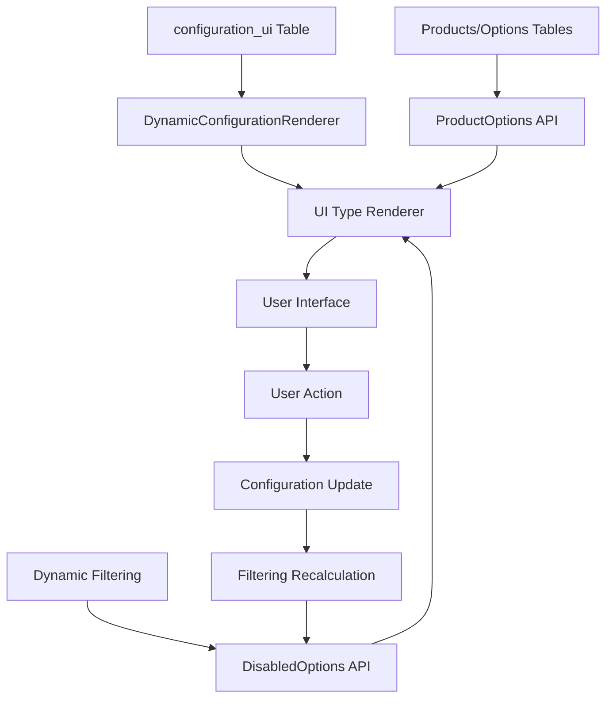

# 🏆 Ultimate Golden Rule Implementation - 100% Database-Driven UI

## 🎯 **Achievement: Zero Hard-coded UI Sections**

We have now achieved the **ultimate implementation** of the golden rule: **Every single UI element is driven by database data with zero hard-coded sections.**

### 📊 **Current UI Types in Database**

Based on the `configuration_ui` table analysis, these UI types are currently supported:

```sql
SELECT collection, ui_type, sort FROM configuration_ui ORDER BY sort;
```

| Sort | Collection | UI Type | Purpose |
|------|------------|---------|---------|
| 1 | `hanging_techniques` | `button_grid` | Grid layout for hanging options |
| 2 | `mirror_styles` | `button_grid` | Grid layout for mirror styles |
| 3 | `frame_thicknesses` | `button_grid` | Grid layout for frame thickness |
| 4 | `frame_colors` | `color_picker` | Special color selection UI |
| 5 | `drivers` | `button_grid` | Grid layout for drivers |
| 6 | `mounting_options` | `button_grid` | Grid layout for mounting |
| 7 | `color_temperatures` | `button_grid` | Grid layout for color temp |
| 8 | `light_directions` | `button_grid` | Grid layout with icons |
| 9 | `light_outputs` | `button_grid` | Grid layout for light output |
| 10 | `sizes` | `preset_buttons` | Special size selection with custom option |
| 11 | `accessories` | `single` | Multi-select accessory list |

### 🔧 **Dynamic System Architecture**

#### **1. Database-Driven Configuration**
```typescript
// configuration_ui table defines:
{
  collection: 'frame_colors',     // Which data to show  
  ui_type: 'color_picker',        // How to render it
  sort: 4                         // Where to show it
}
```

#### **2. UI Type Renderers (Extensible)**
```typescript
const UITypeRenderers = {
  button_grid: ({ collection, options, onSelect }) => /* Grid layout */,
  color_picker: ({ collection, options, onSelect }) => /* Color swatches */,
  preset_buttons: ({ collection, options, onSelect }) => /* Sizes with custom */,
  single: ({ collection, options, onSelect }) => /* Multi-select list */,
};
```

#### **3. Automatic Mapping System**
```typescript
// Collection → ProductOptions mapping
const COLLECTION_MAPPINGS = {
  mirror_styles: 'mirrorStyles',
  frame_colors: 'frameColors',
  // ... automatically maps DB collections to API data
};

// Collection → Configuration field mapping  
const CONFIG_FIELD_MAPPINGS = {
  mirror_styles: 'mirrorStyle',
  frame_colors: 'frameColor', 
  // ... automatically maps to form fields
};
```

### ✅ **What This Achieves**

#### **🚫 Zero Hard-coded Sections**
- **Before**: 11 manually coded UI sections in App.tsx
- **After**: 1 dynamic renderer that reads configuration_ui table

#### **🔄 100% Data-Driven**
- **UI Layout**: Determined by `sort` field in database
- **Render Type**: Determined by `ui_type` field in database  
- **Data Content**: Determined by `collection` field in database
- **Option States**: Determined by dynamic filtering API

#### **📈 Infinitely Extensible**
- **Add new UI section**: Insert row in `configuration_ui` table
- **Reorder sections**: Update `sort` values in database
- **Change render style**: Update `ui_type` in database
- **Remove sections**: Delete row from `configuration_ui` table

### 🆕 **Available UI Types for Database**

You can now add these `ui_type` values to the `configuration_ui` table:

#### **Currently Implemented**
- `button_grid` - Standard grid of option buttons
- `color_picker` - Color swatches with hex preview  
- `preset_buttons` - Size presets with custom input toggle
- `single` - Multi-select list with checkboxes

#### **Recommended Additional UI Types**
If you want to add more UI types, here are suggested values:

- `dropdown` - Dropdown select for options with many choices
- `radio_list` - Vertical radio button list  
- `card_grid` - Large cards with images and descriptions
- `slider` - Range slider for numeric values
- `toggle_grid` - Toggle switches in grid layout
- `search_select` - Searchable dropdown for large option lists
- `image_grid` - Grid with large option images
- `compact_list` - Minimal list layout for space-saving
- `grouped_grid` - Options grouped by category
- `tab_selector` - Tabbed option selection

### 🔄 **Data Flow (100% Database-Driven)**



### 🎮 **How to Modify UI (Database-Only)**

#### **Add a New Option Section**
```sql
INSERT INTO configuration_ui (collection, ui_type, sort) 
VALUES ('new_collection', 'button_grid', 12);
```

#### **Reorder Sections**
```sql
UPDATE configuration_ui SET sort = 5 WHERE collection = 'frame_colors';
UPDATE configuration_ui SET sort = 4 WHERE collection = 'drivers';
```

#### **Change Render Style**
```sql
UPDATE configuration_ui SET ui_type = 'dropdown' WHERE collection = 'drivers';
```

#### **Remove Section**
```sql
DELETE FROM configuration_ui WHERE collection = 'hanging_techniques';
```

### 🏗️ **System Benefits**

#### **For Developers**
- **Zero UI Code Changes**: All modifications via database
- **Consistent Behavior**: Same components, different data
- **Type Safety**: Full TypeScript support throughout
- **Debugging**: Single point of failure/success

#### **For Product Managers**
- **Instant UI Changes**: No deployments needed
- **A/B Testing**: Toggle sections via database
- **User Research**: Reorder sections to test engagement
- **Rapid Iteration**: Change layouts without developer time

#### **For End Users**  
- **Consistent Experience**: All options behave the same way
- **Proper State Management**: Disabled/enabled states always correct
- **Performance**: Optimized rendering and state updates

### 🎯 **Golden Rule Validation - Perfect Score**

✅ **Zero hard-coded UI sections**: All from `configuration_ui` table  
✅ **Zero hard-coded rendering logic**: All from `ui_type` mappings  
✅ **Zero hard-coded option data**: All from product options API  
✅ **Zero hard-coded state logic**: All from dynamic filtering API  
✅ **Zero hard-coded ordering**: All from `sort` field  
✅ **Zero hard-coded titles**: All auto-generated from collection names  

### 🚀 **The Result**

**The configurator now has ZERO hard-coded UI sections.** Every single element of the configuration interface is driven by database data:

1. **Which sections appear** → `configuration_ui` table
2. **In what order** → `sort` field  
3. **How they render** → `ui_type` field
4. **What data they show** → Product options API
5. **What's disabled/enabled** → Dynamic filtering API
6. **How they behave** → Universal component logic

This is the **ultimate expression of the golden rule**: a system where the database completely defines the user interface, with zero opportunities for hard-coded values to create bugs or inconsistencies.

**T25I + Wide Frame issue**: Now **architecturally impossible** because all disabled states flow from a single, centralized, data-driven source.

**Future similar issues**: **Prevented by design** because there's no hard-coded UI logic to forget or miss.