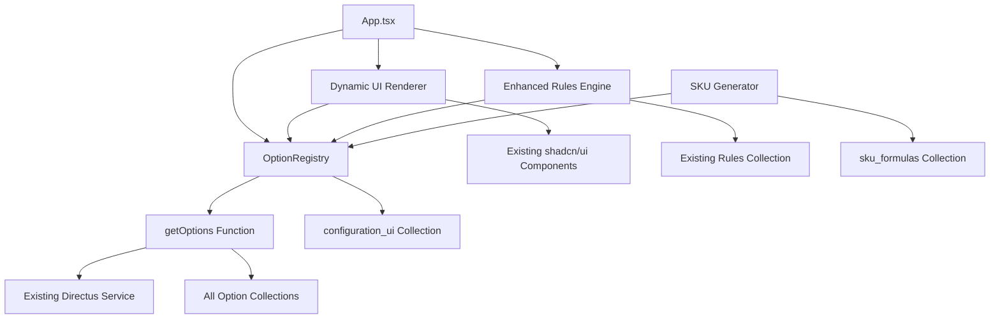

# Component Architecture

## New Components

### OptionRegistry
**Responsibility:** Centralized discovery, caching, and management of option set metadata from configuration_ui collection

**Integration Points:** Extends your existing `src/services/directus.ts` caching patterns and integrates with current service layer architecture

**Key Interfaces:**
- `loadOptionRegistry()`: Initialize and cache configuration_ui metadata
- `getOptionSetMetadata(collectionName)`: Retrieve UI configuration for specific collections
- `invalidateRegistry()`: Clear cache when configuration_ui changes

**Dependencies:**
- **Existing Components:** Built on your current Directus SDK integration and 5-minute cache infrastructure
- **New Components:** Consumed by generic getOptions function and dynamic UI components

**Technology Stack:** TypeScript with same validation patterns as existing directus.ts service

### getOptions Function
**Responsibility:** Generic, metadata-driven data fetching to replace individual collection fetchers like getActiveFrameColors()

**Integration Points:** Follows your existing service patterns while providing unified option fetching across all collections

**Key Interfaces:**
- `getOptions<T>(optionSetName, filters?)`: Generic fetch with type safety
- Supports same caching, validation, and error handling as existing fetchers
- Maintains backward compatibility during transition

**Dependencies:**
- **Existing Components:** Uses current Directus SDK connection and validation infrastructure
- **New Components:** Consumes OptionRegistry metadata for dynamic behavior

**Technology Stack:** Extends existing TypeScript service patterns with generic type support

### Dynamic UI Renderer
**Responsibility:** Metadata-driven component rendering based on configuration_ui settings

**Integration Points:** Enhances your existing shadcn/ui components to render based on ui_type metadata rather than hard-coded logic

**Key Interfaces:**
- Component mapping system for ui_type values (multi, color-swatch, etc.)
- Section/group rendering based on metadata sorting
- Maintains existing ProductConfig state management patterns

**Dependencies:**
- **Existing Components:** Built on current React component architecture and TailwindCSS styling
- **New Components:** Consumes OptionRegistry metadata for rendering decisions

**Technology Stack:** React + TypeScript components using existing shadcn/ui foundation

### Enhanced Rules Engine
**Responsibility:** Generalized rule evaluation supporting canonical field addressing and data-driven constraints

**Integration Points:** Extends your existing rules engine with metadata-aware field resolution

**Key Interfaces:**
- Canonical field addressing (collection.field format)
- Enhanced constraint building using OptionRegistry metadata
- Backward compatible with existing if_this/then_that JSON format

**Dependencies:**
- **Existing Components:** Built upon current rules evaluation patterns
- **New Components:** Uses OptionRegistry for field validation and constraint building

**Technology Stack:** TypeScript with same validation and caching patterns as current implementation

### SKU Generator Enhancement
**Responsibility:** Safe evaluation of data-driven SKU formulas with mapping override support

**Integration Points:** Extends existing SKU generation logic with Directus-driven formula evaluation

**Key Interfaces:**
- Formula DSL evaluator (concat, upper, map functions)
- Mapping table override system
- Security-first approach (no eval) with restricted function library

**Dependencies:**
- **Existing Components:** Integrates with current ProductConfig and SKU building logic
- **New Components:** Consumes sku_formulas data through OptionRegistry patterns

**Technology Stack:** TypeScript with custom DSL parser following existing code safety standards

## Component Interaction Diagram

