# Information Architecture (IA)

## Site Map / Screen Inventory

```mermaid
graph TD
    A[Product Configurator Entry] --> B[Configuration Interface]
    A --> C[Admin Dashboard - Directus]
    
    B --> B1[Product Selection]
    B --> B2[Option Configuration]
    B --> B3[Visual Preview]
    B --> B4[Quote Generation]
    B --> B5[Customer Information]
    
    B2 --> B2A[Frame Colors]
    B2 --> B2B[Mirror Controls]
    B2 --> B2C[Mirror Styles] 
    B2 --> B2D[Mounting Options]
    B2 --> B2E[Light Directions]
    B2 --> B2F[Color Temperature]
    B2 --> B2G[Light Output]
    B2 --> B2H[Drivers]
    B2 --> B2I[Frame Thickness]
    B2 --> B2J[Sizes]
    B2 --> B2K[Accessories]
    
    C --> C1[Option Sets Management]
    C --> C2[Rules Engine]
    C --> C3[SKU Formula Management]
    C --> C4[Image Layer Configuration]
    C --> C5[Configuration UI Registry]
    
    B4 --> B4A[Configuration Summary]
    B4 --> B4B[Pricing Display]
    B4 --> B4C[Export Options]
    
    B5 --> B5A[Contact Details]
    B5 --> B5B[Company Information]
    B5 --> B5C[Project Details]
```

## Navigation Structure

**Primary Navigation:** The configurator uses a step-based flow with clear progress indication. Main sections are Product Selection → Configuration → Preview → Quote → Contact. Each section is accessible via a progress stepper component.

**Secondary Navigation:** Within the Configuration section, options are grouped by category (Visual, Technical, Mounting, etc.) using collapsible sections or tab navigation based on screen size.

**Breadcrumb Strategy:** Context-aware breadcrumbs show: Home → Product Line → Current Configuration Step. For admin users in Directus: Admin → Collection Type → Specific Item.
