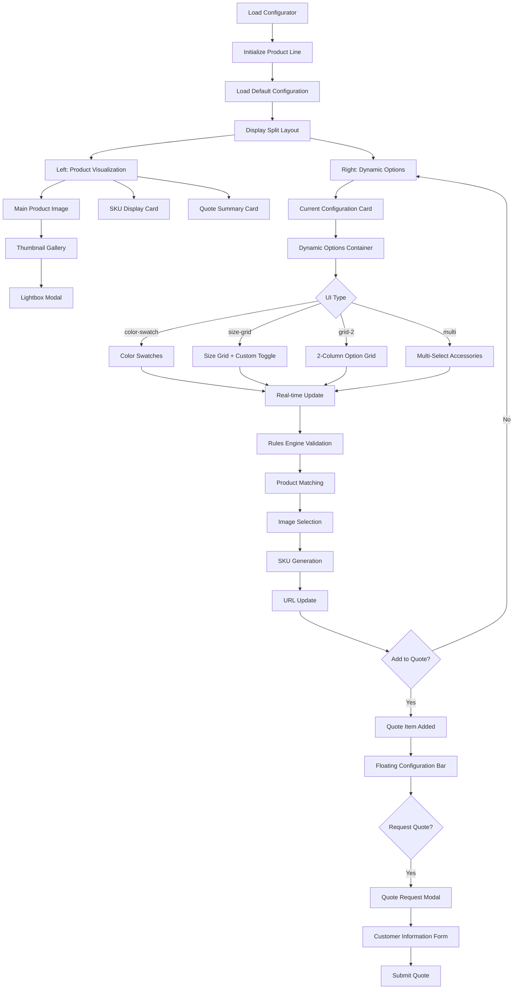
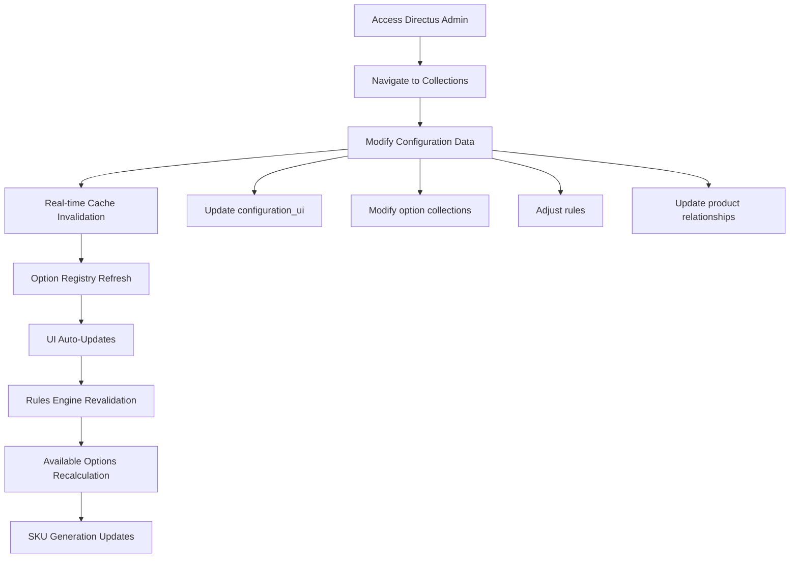

# User Flows

## Primary Configuration Flow (Existing Implementation)

**User Goal:** Configure a mirror/lighting product in real-time with immediate visual feedback

**Entry Points:** Direct URL, embedded configurator widget, SKU search parameter (`?search=D03L24x36`)

**Success Criteria:** User completes configuration, sees live product visualization, adds to quote, submits customer information

### Flow Diagram

### Edge Cases & Error Handling:
- **Rules Engine Conflicts:** Invalid combinations automatically adjust dependent options with visual feedback
- **Product Image Missing:** Fallback to placeholder with clear messaging and orientation indicator
- **API Connection Loss:** Cached data continues working with connection status indicator
- **Invalid SKU Search:** Parse partial matches and suggest corrections
- **Custom Size Limits:** Enforce 12-120 inch range with clear validation messages

**Notes:** The existing implementation uses real-time updates with sophisticated rules engine validation. Every configuration change triggers immediate visual feedback, SKU regeneration, and URL updates for sharing.

## Administrative Data Management Flow (Existing Implementation)

**User Goal:** Manage product configuration through Directus without code changes

**Entry Points:** Directus admin dashboard, configuration_ui collection

**Success Criteria:** Changes appear immediately in configurator with proper validation

### Flow Diagram

### Edge Cases & Error Handling:
- **Invalid UI Type:** System falls back to default grid layout
- **Missing Collection References:** Clear error messages with suggested fixes
- **Rules Validation Failure:** Block creation with specific field guidance
- **Cache Sync Failure:** Manual refresh option available

**Notes:** The established system uses real-time WebSocket updates with polling fallback. All changes propagate immediately to active configurator instances.
