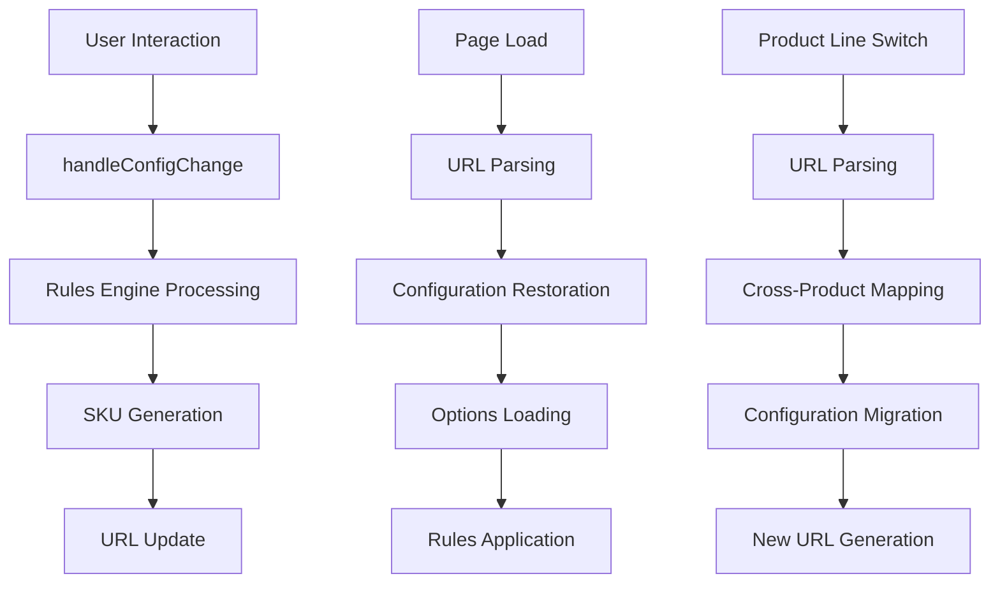

# URL Synchronization Architecture

This document describes the complete architecture for bidirectional synchronization between URL parameters and configurator state in the product configurator.

## Overview

The URL synchronization system ensures that:
1. **User selections are immediately reflected in the URL** for sharing and bookmarking
2. **URLs can be parsed to restore complete configurator state** on page load
3. **Product line switches preserve configuration** when possible
4. **Rules engine overrides are properly reflected** in generated URLs
5. **Performance is optimized** with debouncing and error handling

## Architecture Components

### 1. Core Data Flow



### 2. File Structure

```
src/
├── App.tsx                           # Main sync orchestration
├── utils/
│   ├── sku-url.ts                   # Core URL ↔ SKU conversion
│   └── sku-builder.ts               # SKU generation with overrides
├── hooks/
│   └── useUrlSync.ts                # Performance-optimized sync hook
└── components/
    └── SkuSyncErrorBoundary.tsx     # Error handling and monitoring
```

## Detailed Component Breakdown

### App.tsx - Orchestration Layer

**Responsibilities:**
- Coordinates all URL sync operations
- Handles initial URL parsing on app load  
- Manages product line switches with URL preservation
- Integrates with rules engine for overrides

**Key Functions:**
```typescript
// Initial load: URL → Configuration
loadProductLineOptions(productLine) {
  // Parse URL parameters
  const fromUrl = decodeQueryToSelection(window.location.search, options);
  // Apply to initial config
  const initialConfig = { ...defaults, ...fromUrl };
  // Normalize URL with rules
  const fullSku = buildFullSku(config, options, productLine, overrides);
  window.history.replaceState({}, '', `?search=${fullSku}`);
}

// Config changes: Configuration → URL  
handleConfigChange(field, value) {
  // Update state
  setCurrentConfig(prev => ({ ...prev, [field]: value }));
  // Apply rules
  const overrides = await computeRuleOverrides(config);
  // Generate SKU and update URL
  const fullSku = buildFullSku(config, options, productLine, overrides);
  window.history.replaceState({}, '', `?search=${fullSku}`);
}
```

### sku-url.ts - Core Conversion Logic

**Purpose:** Bidirectional conversion between SKU strings and configuration objects.

**Key Functions:**

1. **encodeSkuToQuery()** - Configuration → Query Parameters
   - Converts configuration object to structured query parameters
   - Applies rules engine overrides
   - Handles size encoding (presets, dimensions, custom formats)
   - Manages composite accessories (AN → NL+AF)

2. **decodeQueryToSelection()** - Query Parameters → Configuration
   - Parses query parameters back to configuration
   - Handles multiple size formats (24x36, 33.533, 2436)
   - Expands composite accessory codes
   - Maps option codes back to IDs

3. **parsePartialSkuToQuery()** - SKU String → Query Parameters
   - Parses full or partial SKU strings
   - Handles product line inference
   - Supports case-insensitive parsing
   - Validates segments against known options

**Data Flow:**
```
Configuration Object → encodeSkuToQuery → Query Parameters → queryToString → URL
URL → URLSearchParams → decodeQueryToSelection → Configuration Object
```

### sku-builder.ts - SKU Generation

**Purpose:** Generate final SKU strings with rules engine integration.

**buildFullSku() Process:**
1. Extract base values from configuration
2. Apply rules engine overrides (priority order)
3. Format segments (core, size, accessories, etc.)
4. Assemble final dash-separated SKU string

**Override Priority:**
1. **Rule Overrides**: `computeRuleOverrides()` output
2. **Product SKU Override**: Specific product codes  
3. **Configuration Selections**: User selections (baseline)

### useUrlSync.ts - Performance Optimization

**Purpose:** Optimize URL updates with debouncing and error handling.

**Features:**
- **Debounced Updates**: Prevent excessive `history.replaceState` calls
- **Optimistic Updates**: Immediate visual feedback while debouncing
- **Batching**: Combine rapid consecutive changes
- **Error Recovery**: Graceful degradation and retry logic

**Usage Pattern:**
```typescript
const { updateUrl, updateUrlImmediate } = useUrlSync({
  debounceMs: 300,
  enableOptimisticUpdates: true
});

// Normal config changes (debounced)
updateUrl({ config, options, productLine, overrides });

// Critical changes (immediate)
updateUrlImmediate({ config, options, productLine, overrides });
```

### SkuSyncErrorBoundary.tsx - Error Handling

**Purpose:** Provide error boundaries and monitoring for sync failures.

**Capabilities:**
- Catch and report synchronization errors
- Provide fallback UI with recovery options  
- Monitor performance and health metrics
- Development-mode debugging tools

## Synchronization Scenarios

### 1. Initial Page Load

```typescript
// 1. Parse URL parameter
const searchSku = new URLSearchParams(window.location.search).get('search');

// 2. Determine product line from SKU
const { productLine, selection } = parseSearchParam(searchSku, products, productLines, options);

// 3. Load options for product line
await loadProductLineOptions(productLine);

// 4. Apply parsed configuration
const initialConfig = { ...defaults, ...selection };
setCurrentConfig(initialConfig);

// 5. Normalize URL with rules
const overrides = await computeRuleOverrides(initialConfig);
const normalizedSku = buildFullSku(initialConfig, options, productLine, overrides);
window.history.replaceState({}, '', `?search=${normalizedSku}`);
```

### 2. Configuration Changes

```typescript
// 1. Update configuration state
setCurrentConfig(prev => ({ ...prev, [field]: value }));

// 2. Recompute availability
await computeAvailableOptions(productLine.id, newConfig);

// 3. Apply rules engine
const overrides = await computeRuleOverrides(newConfig);

// 4. Generate new SKU
const fullSku = buildFullSku(newConfig, options, productLine, overrides);

// 5. Update URL (debounced)
window.history.replaceState({}, '', `?search=${encodeURIComponent(fullSku)}`);
```

### 3. Product Line Switch

```typescript
// 1. Parse current URL to preserve configuration
const currentSku = new URLSearchParams(window.location.search).get('search');
const parsed = parsePartialSkuToQuery(currentSku, oldProductLine.sku_code, oldOptions);

// 2. Switch product line and load new options
await handleProductLineChange(newProductLine);

// 3. Map configuration to new product line
const migrated = decodeQueryToSelection(queryToString(parsed), newOptions);
const newConfig = { ...currentConfig, ...migrated, productLineId: newProductLine.id };

// 4. Apply to new context
setCurrentConfig(newConfig);
await computeAvailableOptions(newProductLine.id, newConfig);

// 5. Generate new URL
const overrides = await computeRuleOverrides(newConfig);
const newSku = buildFullSku(newConfig, newOptions, newProductLine, overrides);
window.history.replaceState({}, '', `?search=${encodeURIComponent(newSku)}`);
```

## Rules Engine Integration

### Override Types

The rules engine can override any SKU segment:

```typescript
interface SkuOverrides {
  // Core overrides
  productSkuOverride?: string;          // Complete product code
  productLineSkuOverride?: string;      // Product line only
  mirrorStyleSkuOverride?: string;      // Mirror style segment
  lightDirectionSkuOverride?: string;   // Light direction segment
  
  // Segment overrides  
  sizeSkuOverride?: string;             // Size segment
  lightOutputSkuOverride?: string;      // Light output segment
  colorTemperatureSkuOverride?: string; // Color temperature segment
  driverSkuOverride?: string;           // Driver segment
  mountingSkuOverride?: string;         // Mounting option segment
  frameColorSkuOverride?: string;       // Frame color segment
  
  // Accessory overrides
  accessoriesOverride?: string;         // Explicit accessory codes
  accessoryFallback?: string;           // Default when no accessories
  includeAccessories?: boolean;         // Whether to include segment
}
```

### Application Flow

1. **Configuration → Rules Context**: Convert user selections to rules format
2. **Rules Processing**: Apply business rules and constraints  
3. **Override Generation**: Extract SKU overrides from processed results
4. **SKU Building**: Apply overrides during SKU generation
5. **URL Update**: Reflect rule-processed SKU in URL

## Performance Characteristics

### Optimization Strategies

1. **Debounced Updates**: 300ms default delay to batch rapid changes
2. **Optimistic Updates**: Immediate visual feedback with later canonical update
3. **Change Detection**: Only update URL when it actually changes
4. **Error Recovery**: Fallback behavior when sync fails
5. **Memory Management**: Cleanup timers and references

### Monitoring Metrics

```typescript
interface SyncStats {
  totalUpdates: number;        // Total URL updates performed
  errorRate: number;           // Percentage of failed updates  
  averageUpdateTime: number;   // Average time per update (ms)
  isHealthy: boolean;          // Overall system health
}
```

**Health Thresholds:**
- Error Rate: < 5%
- Average Update Time: < 50ms
- Update Frequency: Reasonable for user interaction patterns

## Error Handling Strategy

### Error Categories

1. **Parsing Errors**: Invalid URL parameters or SKU format
2. **Generation Errors**: SKU building failures  
3. **Update Errors**: Browser API failures (history.replaceState)
4. **Rules Errors**: Rules engine processing failures

### Recovery Mechanisms

1. **Graceful Degradation**: Continue operation with limited functionality
2. **Automatic Retry**: Retry failed operations with exponential backoff
3. **User Recovery**: Clear error UI with manual recovery options
4. **State Reset**: Reset to known good state when necessary

### Error Reporting

```typescript
// Automatic error reporting
if (window.errorTracker) {
  window.errorTracker.captureException(error, {
    context: 'sku-sync',
    extra: { syncStats, config, url }
  });
}
```

## Testing Strategy

### Unit Tests (sku-url.test.ts)

- **Round-trip consistency**: Configuration → URL → Configuration
- **Edge cases**: Empty values, malformed input, missing data
- **Format support**: All size formats, composite accessories
- **Error handling**: Invalid input graceful degradation

### Integration Tests

- **App.tsx sync behavior**: Full flow testing
- **Product line switches**: Configuration preservation  
- **Rules integration**: Override application
- **Performance**: Debouncing and batching behavior

### End-to-End Tests

- **Browser reload**: URL restoration
- **URL sharing**: Cross-session consistency
- **Error scenarios**: Network failures, malformed URLs
- **Product line compatibility**: Cross-product URLs

## Migration and Compatibility

### Legacy URL Support

The system maintains backward compatibility with legacy query parameter formats:

```
# Legacy format (still parsed on initial load)
?ms=3&ld=L24&sz=24x36&lo=300&ct=3K

# Modern format (generated for all new URLs)  
?search=ECLIPSE3L24-24X36-300-3K-FEM-P-PBB
```

### URL Format Evolution

Future enhancements can be added while maintaining backward compatibility:
- New SKU segments (hanging technique placeholder exists)
- Product line specific encoding rules
- Extended override capabilities

## Development and Debugging

### Development Tools

1. **SkuSyncMonitorDisplay**: Real-time performance monitoring
2. **Console Logging**: Detailed sync operation logs in dev mode
3. **Error Boundary**: Development error details and stack traces

### Debugging Techniques

1. **URL History**: Check browser dev tools Network/History for URL changes
2. **Console Logs**: Monitor SKU generation and parsing operations
3. **Performance Monitor**: Track update frequency and error rates
4. **Error Boundary**: Detailed error reporting with context

## Future Enhancements

### Planned Improvements

1. **Service Worker Caching**: Offline URL parsing support
2. **Analytics Integration**: User behavior tracking for URL usage
3. **A/B Testing**: Different URL strategies for optimization
4. **Advanced Error Recovery**: More sophisticated retry strategies

### Extensibility

The architecture supports extension through:
- Additional SKU segments and formats
- Custom encoding rules per product line
- Enhanced rules engine integration
- External sync targets (analytics, session storage, etc.)

## Conclusion

The URL synchronization architecture provides a robust, performant, and maintainable system for keeping configurator state and URLs in perfect sync. The modular design allows for easy testing, debugging, and future enhancements while maintaining backward compatibility and graceful error handling.
